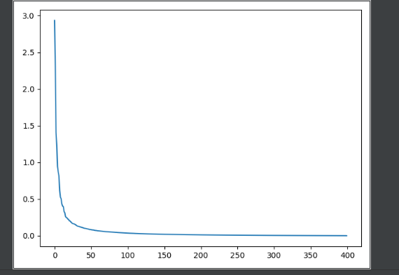
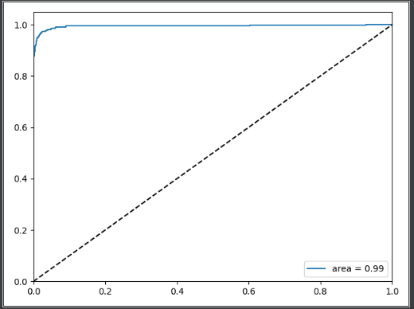

## 预处理

从 [搜狗实验室](https://www.sogou.com/labs/) 下载数据，标点符号去除和去除停用词，然后写到`data/simple.reg.txt`

## word2vec 

对应文件在`word2vec.py`,保存模型文件到`data`目录下

后续可以使用bert。

## word2vec测试

对应文件在`word2vec_verify.py`

## 使用svm进行二分类

`comment_to_df.py`和`pca_svm.py`

`comment_to_df.py`主要完成从训练好的model里面找到每一个评论分词对应的向量，然后进行平均值计算，得到每一个评论的向量值，再将y值分为0和1,保存到2000.csv文件。

`pca_svm.py`将`2000.csv`中的向量值进行降维，可以看到在前100个维度时就可以表达绝大对数的信息，那么选取前100个维度的信息，进行分类。

运行后得到Test Accuracy:  0.9728761514841351，ROC曲线如下。

